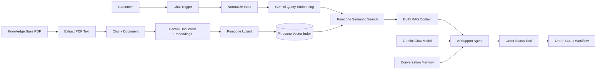

# NovaStore AI Customer Support RAG Agent

A portfolio-grade AI customer support system built with **n8n**, **Google Gemini**, and **Pinecone**. The project combines Retrieval-Augmented Generation (RAG), conversational memory, semantic search, and agent tool calling to answer policy questions from a controlled knowledge base and retrieve mock live order information.

## Why this project

The goal is to demonstrate a realistic AI automation architecture rather than a standalone chatbot. Policy knowledge is indexed separately from runtime conversations, customer questions are embedded and retrieved semantically, and operational questions about a specific order are delegated to a dedicated tool workflow.

## Architecture


## Workflow Screenshots

### Main AI Support Agent

The main workflow handles user input, generates semantic embeddings, retrieves relevant knowledge from Pinecone, builds the RAG context, and sends it to an AI Agent with conversational memory and tool-calling capabilities.


### Knowledge Base Ingestion Pipeline

This workflow processes the NovaStore knowledge base, extracts the PDF content, splits it into overlapping chunks, generates 768-dimensional embeddings with Gemini, and indexes them in Pinecone.


### Order Status Tool

The AI Agent can call a dedicated n8n sub-workflow to retrieve live-style order information when a customer provides an order ID.


## Core features

- **RAG knowledge retrieval** for returns, refunds, shipping, warranty, payments, cancellations, and support policies.
- **Semantic search** in Pinecone using 768-dimensional Gemini embeddings and cosine similarity.
- **Custom document ingestion** with approximately 1,000-character chunks and 200-character overlap.
- **AI agent tool calling** for order-specific questions such as shipping status, carrier, tracking number, and estimated delivery.
- **Conversation memory** keyed by the n8n chat session ID.
- **Grounding rules** instruct the agent not to invent policy information and to use the order tool for specific order-status requests.
- **Credential isolation** through n8n credentials instead of hard-coded API keys.
- **Modular architecture** separating document ingestion, customer-facing retrieval, and operational tool execution.

## Workflows

### 1. AI Customer Support RAG Agent

Runtime customer-support pipeline:

`Chat Trigger → Normalize Input → Gemini Query Embedding → Pinecone Semantic Search → Build RAG Context → AI Support Agent`

The AI Support Agent also receives a Gemini chat model, conversation memory, and the Order Status Tool.

### 2. Knowledge Base Ingestion

Indexing pipeline:

`Manual Trigger → Read Knowledge Base PDF → Extract PDF Text → Chunk Document → Gemini Document Embeddings → Pinecone Upsert`

The ingestion workflow is intentionally separated from runtime retrieval so the knowledge base can be updated independently.

### 3. NovaStore Order Status API

A tool workflow that accepts an `order_id` and returns mock operational data. It demonstrates how the agent can call an external business system instead of relying on RAG for live transactional information.

In a production implementation, this mock lookup could be replaced by Shopify, WooCommerce, an ERP, CRM, or internal REST API.

## Tech stack

| Component | Technology |
|---|---|
| Workflow orchestration | n8n |
| Embeddings | Google Gemini Embedding API |
| Vector database | Pinecone |
| LLM / Agent | Google Gemini |
| RAG processing | Custom JavaScript + n8n |
| Agent memory | n8n Conversation Memory |
| Tool calling | n8n Workflow Tool |
| Local environment | Docker |
| Data/API format | REST / JSON |

## Retrieval design

The included NovaStore support PDF is extracted and split into overlapping chunks. Each chunk contains metadata such as document name, source, version, and chunk ID. Gemini generates a 768-dimensional vector for each chunk, which is stored in the `novastore-support` Pinecone namespace.

At query time, the customer message is embedded using the same dimensionality. Pinecone returns the top three semantic matches, and their metadata text is formatted into a RAG context before being passed to the agent.

## Agent routing

The agent uses two different sources of truth:

- **Knowledge Base:** general company policies and support information.
- **Order Status Tool:** information about a specific order ID.

This separation prevents a vector knowledge base from being treated as a source of real-time transactional state.

Example order IDs included in the mock tool:

- `NS-10452` — Shipped
- `NS-20891` — Processing
- `NS-33721` — Delivered

## Example tests

**Policy question**

> How many days do I have to return a product?

Expected behavior: retrieve the relevant return-policy chunk and answer that most eligible products can be returned within 30 calendar days from delivery.

**Grounding test**

> Does NovaStore offer a 25% student discount?

Expected behavior: do not invent a discount because the knowledge base does not contain that policy.

**Tool-calling test**

> Where is my order NS-10452?

Expected behavior: invoke the Order Status Tool instead of answering from the knowledge base.

## Security

API secrets are not intended to be stored directly in the exported workflows. Gemini and Pinecone authentication should be configured through n8n Credentials.

Before importing or publishing workflows:

1. Create your own Gemini and Pinecone credentials in n8n.
2. Attach those credentials to the corresponding HTTP/model nodes.
3. Never commit `.env` files, API keys, or credential exports.
4. Rotate any key that has been accidentally exposed.

> Note: exported n8n workflow files can contain local workflow IDs, webhook IDs, instance metadata, credential references, and service hosts. These are not API secrets, but you may sanitize them further before using the repository as a public template.

## Repository structure

```text
novastore-ai-support-agent/
├── README.md
├── .gitignore
├── .env.example
├── workflows/
│   ├── ai-customer-support-rag-agent.json
│   ├── knowledge-base-ingestion.json
│   └── order-status-tool.json
├── knowledge-base/
│   └── NovaStore_Customer_Support_Knowledge_Base.pdf
└── docs/
    └── screenshots/
```

## Running the project

1. Run n8n locally or in a hosted environment.
2. Create a Pinecone dense index with **768 dimensions** and **cosine similarity**.
3. Configure Gemini and Pinecone credentials in n8n.
4. Import the three workflow JSON files.
5. Update the Pinecone host in the HTTP Request nodes if using a different index.
6. Make the knowledge-base PDF available to n8n and update the file path if needed.
7. Run the ingestion workflow to create the vectors.
8. Open the customer-support workflow and test policy questions.
9. Test an order-specific question using one of the sample order IDs.

## Production improvements

The portfolio version focuses on architecture and integration. A production deployment could add retrieval score thresholds, structured logging, persistent memory, human handoff, automated evaluation, rate-limit handling, observability, authentication, real commerce APIs, and CI/CD.

## Project status

The RAG ingestion and semantic retrieval pipeline were validated successfully. Grounded fallback behavior was also tested. The Order Status Tool invocation was observed from the agent workflow; final response generation during that test was blocked by the Gemini provider quota, rather than by the tool architecture itself.

## Author

**Joaquín Portnoy**  
AI Automation / Workflow Automation  
La Plata, Buenos Aires, Argentina
